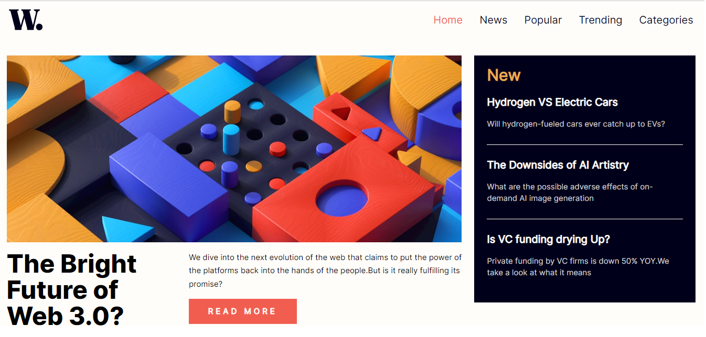
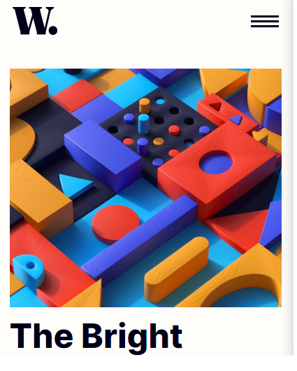
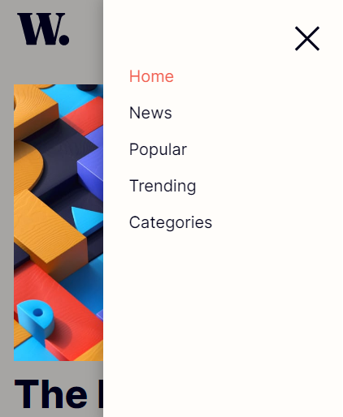

# Frontend Mentor - News homepage solution

This is a solution to the [News homepage challenge on Frontend Mentor](https://www.frontendmentor.io/challenges/news-homepage-H6SWTa1MFl). Frontend Mentor challenges help you improve your coding skills by building realistic projects. 

## Table of contents

- [Overview](#overview)
  - [The challenge](#the-challenge)
  - [Screenshot](#screenshot)
  - [Links](#links)
- [My process](#my-process)
  - [Built with](#built-with)
  - [What I learned](#what-i-learned)
  - [Continued development](#continued-development)
  - [Useful resources](#useful-resources)
- [Author](#author)
- [Acknowledgments](#acknowledgments)


## Overview

### The challenge

Users should be able to:

- View the optimal layout for the interface depending on their device's screen size
- See hover and focus states for all interactive elements on the page

### Screenshot





### Links

- Solution URL: [Add solution URL here](https://www.frontendmentor.io/solutions/news-homepage-p6Y7hFDtL8)
- Live Site URL: [Add live site URL here](https://frontendmentor-challenge-1-nu.vercel.app/)

## My process

### Built with

- Semantic HTML5 markup
- CSS custom properties
- Flexbox
- CSS Grid
- Mobile-first workflow
- Position Relative, Absolute, Fixed

### What I learned

I learnt about grid system and for responsive version picture element tag is really useful for me to make a responsive image change.

```html
<picture>
    <source 
        media="(min-width : 1024px)"
        srcset="./assets/images/image-web-3-desktop.jpg"
    >
    
</picture>
```
```css
@font-face {
    font-family: "Inter, Regular";
    src: url("../assets/fonts/static/Inter-Regular.ttf");
}
```

### Useful resources

- [resource 1](https://www.w3schools.com/) - This helped me for responsive reason. I really liked this pattern and will use it going forward.
- [resource 2](https://stackoverflow.com/) - This website help me to know everything that I do not know


## Author

- Website - [Yel Yan](https://www.your-site.com)
- Frontend Mentor - [@kmin2957@gmail.com](https://www.frontendmentor.io/profile/Yel-Yan-Is-21)
- Behance - [@yourusername](https://www.behance.net/yelyanwebdesigner)

